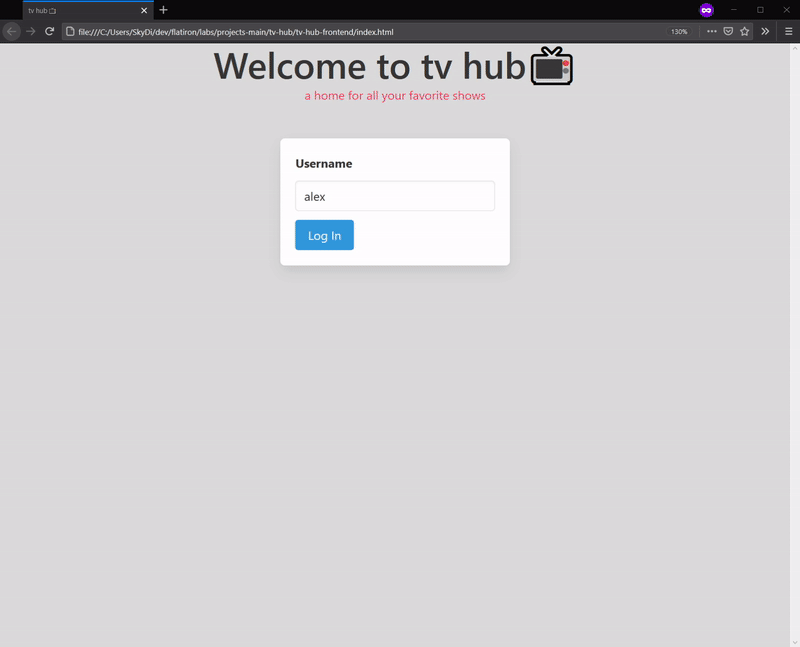

# tv hub 📺

Simple single page application for avid movie and tv show watchers to help them keep track of their shows. Users can search titles, add them to their personal collection and give them a review.



## Installing

1. Go to backend directory and install dependencies

   ```bash
   cd tv-hub-backend && bundle install
   ```

2. Set up and start rails server

   ```bash
   rails db:migrate && rails s
   ```

3. Go to frontend directory and open main html file in browser

   ```bash
    cd .. && cd tv-hub-frontend && sensible-browser index.html
   ```

## Built with

- [JavaScript](https://developer.mozilla.org/en-US/docs/Web/JavaScript)
- [Ruby](https://www.ruby-lang.org/en/)
- [Rails](https://rubyonrails.org/)
- [Bulma](https://bulma.io/)
- [TV API](https://www.tvmaze.com/api)
